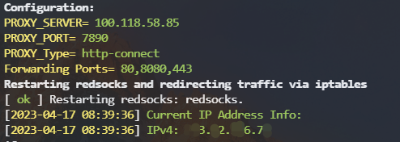

# Docker Container TProxy
为 Docker 容器中配置透明代理的功能，适用于Docker Container 内程序不遵从系统 `ALL_PROXY,http_proxy,https_proxy` 环境变量的情况。通过使用 iptables 将流量转发到本地启动的   Redsocks 透明代理上。

## 使用方法
``` shell
docker run -d --name warp -e PROXY_SERVER=1.1.1.1 -e PROXY_PORT=8888 -e PROXY_Type=http-connect --cap-add NET_ADMIN --network container:[YouContainerName] privileges/tproxy:latest
```

其中，需要根据实际情况替换以下的值：
- `PROXY_SERVER`: 代理服务器地址
- `PROXY_PORT`: 代理服务器端口
- `PROXY_Type`: [代理类型](https://github.com/darkk/redsocks/blob/master/redsocks.conf.example#L97) `socks4`,`socks5`,`http-connect`,`http-relay`
- `--network container:Name` 填写需要被代理的容器名
- `Ports`: 默认 `80,8080,443` 端口的出口流量将被转发，也可以通过 `-e Ports=80,8090,9090` 指定，每个端口之间用 `,` 分隔

如果你的代理服务添加了用户认证，则需要增加以下配置项
- `PROXY_USERNAME`
- `PROXY_PASSWORD`

```
docker logs warp
```


### 感谢
- Bruno Amaro Almeida - [How to transparently use a proxy with any application (Docker) using Iptables and RedSocks](https://medium.datadriveninvestor.com/how-to-transparently-use-a-proxy-with-any-application-docker-using-iptables-and-redsocks-b8301ddc4e1e)

- [proxy-via-iptables](https://github.com/brunoamaroalmeida/awesome-quickstart-containers/tree/master/proxy-via-iptables)